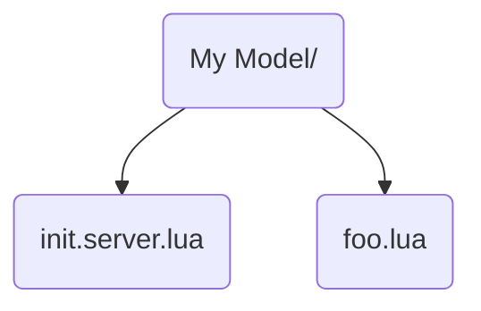
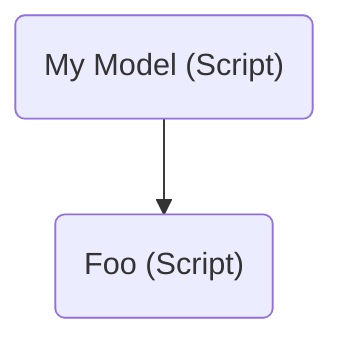
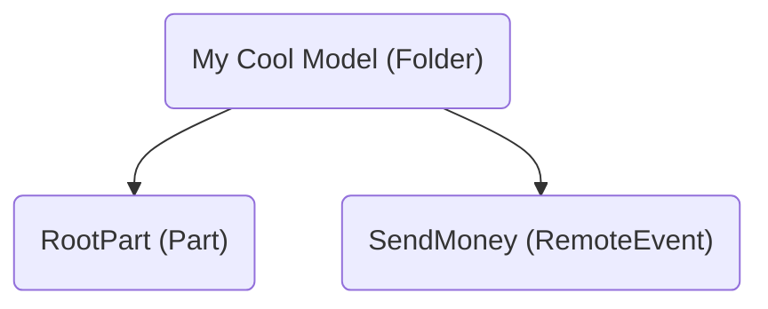

# Sync Details

This page aims to describe how Rojo turns files on the filesystem into Roblox objects.

## Overview

| Concept                                     | File Name        |
|:------------------------------------------- |:---------------- |
| [Folders](#folders)                         | any directory    |
| Server [Scripts](#scripts)                  | `*.server.lua`   |
| Client [Scripts](#scripts)                  | `*.client.lua`   |
| Module [Scripts](#scripts)                  | `*.lua`          |
| XML [Models](#models)                       | `*.rbxmx`        |
| Binary [Models](#models)                    | `*.rbxm`         |
| [Localization Tables](#localization-tables) | `*.csv`          |
| [Plain Text](#plain-text)                   | `*.txt`          |
| [JSON Modules](#json-modules)               | `*.json`         |
| [JSON Models](#json-models)                 | `*.model.json`   |
| [Projects](#projects)                       | `*.project.json` |
| [Meta Files](#meta-files)                   | `*.meta.json`    |

## Limitations

Not all property types can be synced by Rojo in real-time due to limitations of the Roblox Studio plugin API. In these cases, you can usually generate a place file and open it when you start working on a project.

Some common cases you might hit are:

- Binary data (Terrain, CSG parts)
- `MeshPart.MeshId`
- `HttpService.HttpEnabled`

For a list of all property types that Rojo can reason about, both when live-syncing and when building place files, look at [rbx-dom's type coverage chart](https://github.com/Roblox/rbx-dom#property-type-coverage).

This limitation may be solved by [issue #205](https://github.com/rojo-rbx/rojo/issues/205) in the future.

## Folders

Any directory on the filesystem will turn into a `Folder` instance with the same name.

It is possible for a directory to contain certain files that change what the directory turns into:

- An `init.lua`, `init.server.lua`, or `init.client.lua` file, described in [Scripts](#scripts).
- An `init.meta.json` file that defines `className`, described in [Meta Files](#meta-files).
- A `default.project.json` file, described in [Projects](#projects).

## Scripts

Rojo transforms any files with the `lua` extension into the various script instances that Roblox has.

- Any file ending in `.server.lua` will turn into a `Script` instance.
- Any file ending in `.client.lua` will turn into a `LocalScript` instance.
- Any other `.lua` file will turn into a `ModuleScript` instance.

Rojo reserves three special script names. These scripts change their parent directory into a script instead of a folder:

- `init.server.lua` will change its parent directory into a `Script` instance.
- `init.client.lua` will change its parent directory into a `LocalScript` instance.
- `init.lua` will change its parent directory into a `ModuleScript` instance.

For example, these files:



Will turn into these instances in Roblox:



Only one "init script" can be present in the same folder.

## Models

Rojo supports both binary (`.rbxm`) and XML (`.rbxmx`) models generated by Roblox Studio or another tool.

Support for `rbxmx` is very good, while support for `rbxm` is still very early, buggy, and lacking features.

For a rundown of supported types, check out [rbx-dom's type coverage chart](https://github.com/rojo-rbx/rbx-dom#property-type-coverage).

## Localization Tables

Any file with the `csv` extension is transformed into a `LocalizationTable` instance. Rojo expects these files to follow the same format that Roblox does when importing and exporting localization information.

An example CSV localization table is:

```csv
Key,Source,Context,Example,es
Ack,Ack!,,An exclamation of despair,¡Ay!
```

## Plain Text

Any file with the `txt` extension is transformed into a `StringValue` instance. This is useful for bringing in text data that can be read by scripts at runtime.

## JSON Modules

Any file with the `json` extension that is not a [JSON Model](#json-models) or a [Project File](#project-file)

## TOML Modules

Any file with the `toml` extension will be synced as a `ModuleScript` that returns a table representing the same structure as the TOML file. Due to the easy to read and edit format of TOML, it can be convenient to use them as config files.

There is a single limitation for TOML syncing: `DateTime` values are converted into `string` values and not the corresponding data type. This is due to the conflicting formats used between them. This is not something most people should have to worry about, but it's still something to be aware of.

## JSON Models

Files ending in `.model.json` can be used to describe simple models. They're designed to be hand-written and are useful for instances like `RemoteEvent`.

A JSON model describing a folder containing a `Part` and a `RemoteEvent` could be written as a file named `My Cool Model.model.json` with:

```json
{
  "ClassName": "Folder",
  "Children": [
    {
      "Name": "RootPart",
      "ClassName": "Part",
      "Properties": {
        "Size": [4, 4, 4]
      }
    },
    {
      "Name": "SendMoney",
      "ClassName": "RemoteEvent"
    }
  ]
}
```

It would turn into these instances:



## Projects

Starting in Rojo 6.0, project files can be included in other project files. This can be useful for reusing pieces between multiple project files.

Projects that are intended to be included inside other projects should describe models, not places.

If a directory contains a file named `default.project.json`, Rojo will use the contents of the project file instead of anything else in the directory.

## Meta Files

New in Rojo 0.5 are meta files, named `.meta.json`.

Meta files allow attaching extra Rojo data to models defined in other formats, like Roblox's `rbxm` and `rbxmx` model formats, or even Lua scripts.

This can be used to set Rojo-specific settings like `ignoreUnknownInstances`, or can be used to set properties like `Disabled` on a script.

Meta files can contain:

- `className`: Changes the `className` of a containing `Folder` into something else.
  - Usable only in `init.meta.json` files
- `properties`: A map of properties to set on the instance, just like projects
  - Usable on anything except `.rbxmx`, `.rbxm`, and `.model.json` files, which already have properties
- `ignoreUnknownInstances`: Works just like `$ignoreUnknownInstances` in project files

### Meta Files to set Rojo metadata

Sometimes it's useful to apply properties like `ignoreUnknownInstances` on instances that are defined on the filesystem instead of within the project itself.

If your project has `hello.txt` and there are instances underneath it that you want Rojo to ignore when live-syncing, you could create `hello.meta.json` with:

```json
{
  "ignoreUnknownInstances": true
}
```

### Meta Files for Disabled Scripts

Meta files can be used to set properties on `Script` instances, like `Disabled`.

If your project has `foo.server.lua` and you want to make sure it would be disabled, you could create a `foo.meta.json` next to it with:

```json
{
  "properties": {
    "Disabled": true
  }
}
```

### Meta Files for Tools

If you wanted to represent a tool containing a script and a model for its handle, create a directory with an `init.meta.json` file in it:

```json
{
  "className": "Tool",
  "properties": {
    "Grip": [0, 0, 0, 1, 0, 0, 0, 1, 0, 0, 0, 1]
  }
}
```

Instead of a `Folder` instance, you'll end up with a `Tool` instance with the `Grip` property set.
